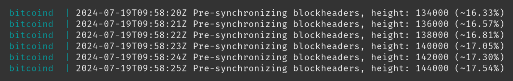
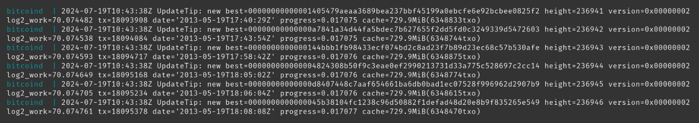
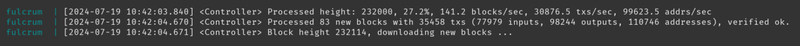
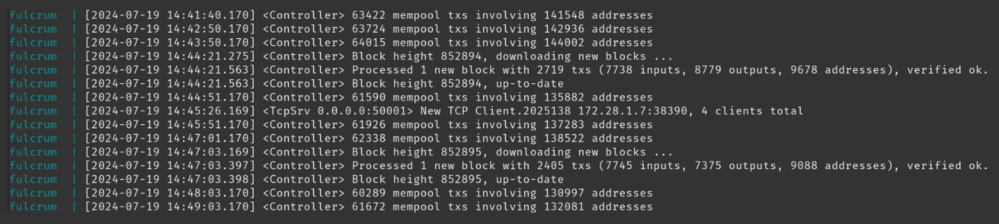

import { Steps } from '@astrojs/starlight/components';
import ImageZoom from 'starlight-image-zoom/components/ImageZoom.astro'

<ImageZoom />

When installing Dojo for the first time, due to various factors it can take between 2 and 7 days to complete the Initial Block Download (IBD) and indexing of the Fulcrum Server.

Contained in this guide are two methods to monitor the syncing status of your Dojo:


1. Using the Dojo Maintenance Tool
    - Difficulty: Easy
    - Syncing information: Less informative
2. Looking at your Dojo logs
    - Difficulty: Intermediate
    - Syncing information: Very informative


## Check the status in the Dojo Maintenance Tool
This is the most simple and easy method, however during the syncing period is less informative as the information displayed on the "status" page of the Dojo Maintenance Tool lacks some information during your Dojo's initial sync. For example it will not show a live indexing status of your Fulcrum indexer.

However when **everything is fully synced**, it will show:

- All green checks ✅
- The "latest block" next to each status card (Full Node, Indexer, Tracker, and Dojo DB)


Example:


### How to login to your Dojo Maintenance Tool
Follow this guide to obtain your Dojo Maintenance Tool (DMT) URL, and login using the Tor browser.

## Check the status in the logs
Using the log commands in the terminal of your Dojo will give you better live updates as to the current syncing status, including the status of the Fulcrum indexing progress (which the DMT can not do).

In the terminal of your Dojo, copy and paste the following commands, then press `ENTER`.

<Steps>
1. Navigate to the Dojo script directory
    ```sh
    cd ~/dojo-app/docker/my-dojo
    ```
    All commands which start ```./dojo.sh``` are to be run in this directory.

2. Show Bitcoind logs
    ```sh
    ./dojo.sh logs bitcoind
    ```
    These logs will show the Initial Block Download (IBD) status.
</Steps>

When first installing Dojo you will observe in these logs ```pre-synchronizing blockheaders```. For example:



<center>```Pre-synchronizing blockheader status = 17.54%```</center>

Once this reaches 100%, you will then observe in these logs your node move onto downloading a full copy of the blockchain. For example:



<center>```IBD progress = 0.017077 (1.7077%)```</center>

Inspecting these logs you will observe the block ```height``` and ```progress``` of the IBD:

- ```height``` = the current bitcoin block being downloaded
- ```progress``` = the percentage amount of the blockchain that has been downloaded
    - For example:

        ```progress = 0.051000``` IBD is 5.1% complete

        ```progress = 0.915000``` IBD is 91.5% complete


When ```progress = 1.000000``` the IBD has been fully downloaded. For example:


<center>```IBD progress = 1.000000 (100%)```</center>

Press ```ctrl + c``` to exit back to the terminal.

### Show Fulcrum logs
```sh
./dojo.sh logs fulcrum
```
These logs will show the Fulcrum indexing status.

When Bitcoind finishes pre-synchronizing blockheaders, Fulcrum will begin to index. For example:



<center>```Fulcrum indexing status = 27.2%```</center>


Inspecting these logs you will observe the ```processing height``` shown in:
- Block height
- Percentage


When ```processing height = 100%``` Fulcrum has finishes indexing the IBD. Then the logs will look more like this:



Press `ctrl + c` to exit back to the terminal.

### Tracker status
Once the IBD is complete and Fulcrum has fully indexed, the Dojo tracker will then start syncing.

Monitoring the Dojo tracker syncing status via the logs is not very informative. Luckily the tracker syncs quite quickly (usually in a couple of hours, if not quicker).

To best monitor this, login to your DMT and wait for a green check in the "status" page.

Once all check marks turn green in the DMT, you are ready to start connecting a wallet to your wallet server.
