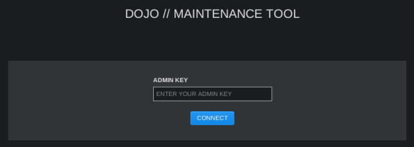
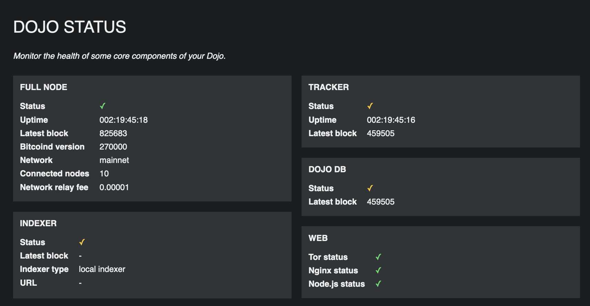
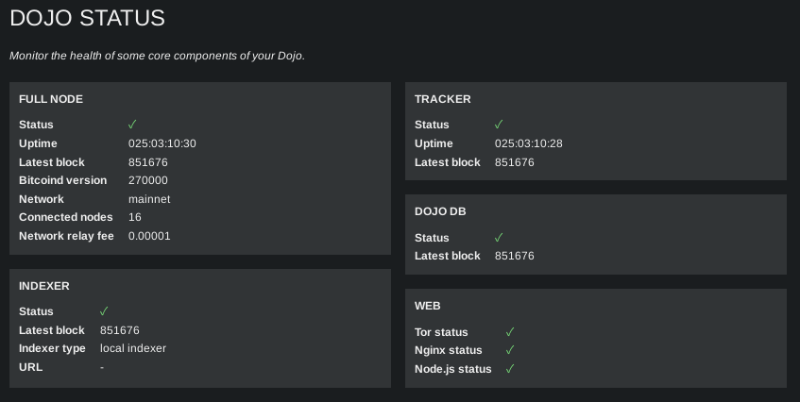

import { Steps } from '@astrojs/starlight/components';
import ImageZoom from 'starlight-image-zoom/components/ImageZoom.astro'

<ImageZoom />

Access your Dojo Maintenance Tool (DMT) to:

- Check on your wallet server's status
- Pair a wallet to Dojo
- Manage your tracked wallet's extended public keys


## Obtain your DMT .onion URL
In the terminal of your device, copy and paste the following commands, then press `ENTER`.

<Steps>
1. Navigate to the Dojo script directory
    ```sh
    cd ~/dojo-app/docker/my-dojo
    ```

2. Enter the Dojo onion command
    ```sh
    ./dojo.sh onion
    ```
</Steps>
Shown in the terminal is `Dojo API and Maintenance Tool` URL.

### Save / bookmark your DMT URL
Add this URL to your password manager with `/admin` at the end. For example:
`wo4zobymdl45gmmzzmpoypeemoukbj74wpibc22rxs2yfgpej62v6dyd.onion/admin`

This is your `DMT URL`.

You may also choose to save this URL as a bookmark in your Tor desktop and/or mobile browser.

## Login to your Dojo Maintenance Tool
Launch the Tor desktop browser.

**Note**: your Tor browser must be set to either security level "standard" (default), or "safer", as javascript is required for the site.

Paste your `DMT URL` into the URL bar.



Paste your `NODE_ADMIN_KEY`, then click CONNECT to login.

Note: your `NODE_ADMIN_KEY` was one of the admin credentials you generated and set prior to installing Dojo. At the time of doing so, you should have saved this in your password manager.

## Dojo status page
After logging in you will see the status page of your Dojo.



If your Dojo is fully synced, you will see all green checks ✅



If you Dojo is not synced, or your Dojo is experiencing issues, you will observe red crosses and/or orange checks.
