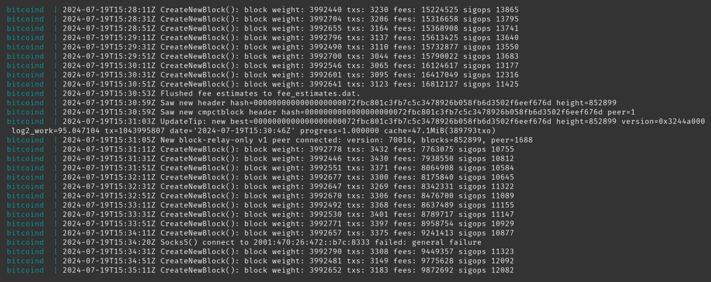
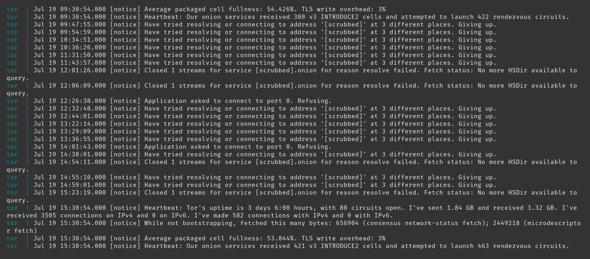
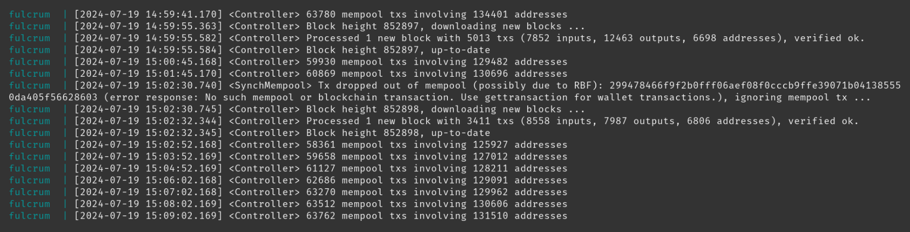
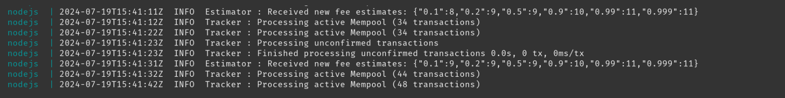
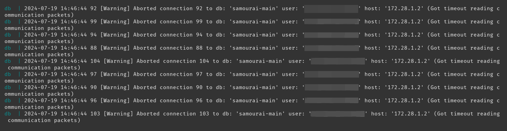
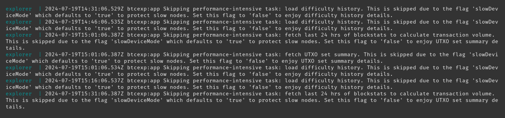

import ImageZoom from 'starlight-image-zoom/components/ImageZoom.astro'

<ImageZoom />

After your wallet server is fully synced, you may choose to check on the logs from time to time to ensure everything looks healthy. If you are experiencing issues with your Dojo, by checking the logs you may be able to identify the fault and look to fix it.

## How to obtain logs
In the terminal of your Dojo, copy and paste the following commands, then press `ENTER`.

### Navigate to the Dojo script directory
```sh
cd ~/dojo-app/docker/my-dojo
```
All commands which start `./dojo.sh` are to be run in this directory.

### Show all logs
```sh
./dojo.sh logs
```
Press `ctrl + c` to exit back to the terminal.

### Show Bitcoind logs
```sh
./dojo.sh logs bitcoind
```
Press `ctrl + c` to exit back to the terminal.

### Show Tor logs
```sh
./dojo.sh logs tor
```
Press `ctrl + c` to exit back to the terminal.

### Show Fulcrum logs
```sh
./dojo.sh logs fulcrum
```
Press `ctrl + c` to exit back to the terminal.

### Show NodeJS logs
**Warning**: these logs can contain sensitive information pertaining to wallets connected to your wallet server. As such, consideration should be made prior to sharing these with any third-party.

```sh
./dojo.sh logs node
```
Press `ctrl + c` to exit back to the terminal.

### Show Dojo DB logs
**Warning**: the "user" field contained in these logs, though not a security risk, may be a privacy risk. As such, consideration should be made prior to sharing these with any third-party.

```sh
./dojo.sh logs db
```
Press `ctrl + c` to exit back to the terminal.

### Show Explorer logs
```sh
./dojo.sh logs explorer
```
Press `ctrl + c` to exit back to the terminal.

## Examples of healthy logs
The following healthy logs have been captured after Dojo has completed its initial sync.

### Bitcoind



### Tor



### Fulcrum



### NodeJS
**Warning**: these logs can contain sensitive information pertaining to wallets connected to your Dojo. As such, consideration should be made prior to sharing these with any third-party.



### Dojo DB
**Warning**: the "user" field contained in these logs, though not a security risk, may be a privacy risk. As such, consideration should be made prior to sharing these with any third-party.



### Explorer


