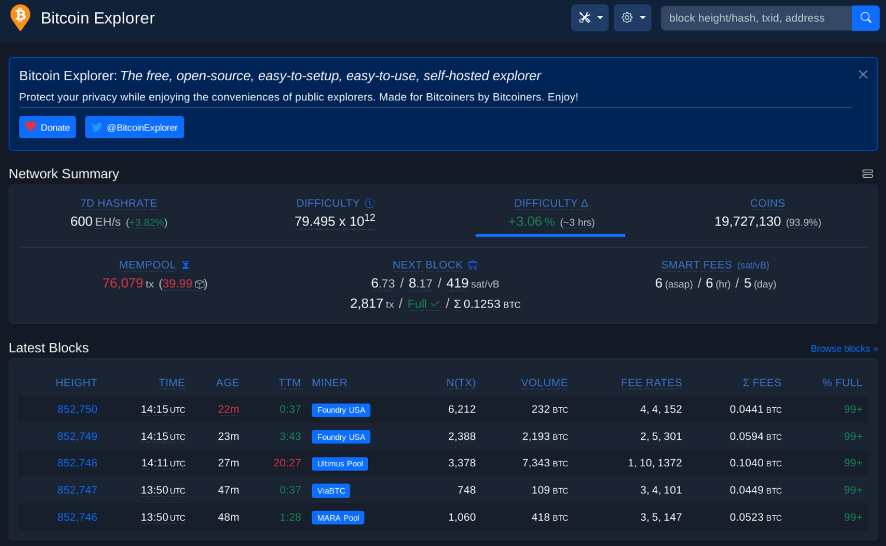
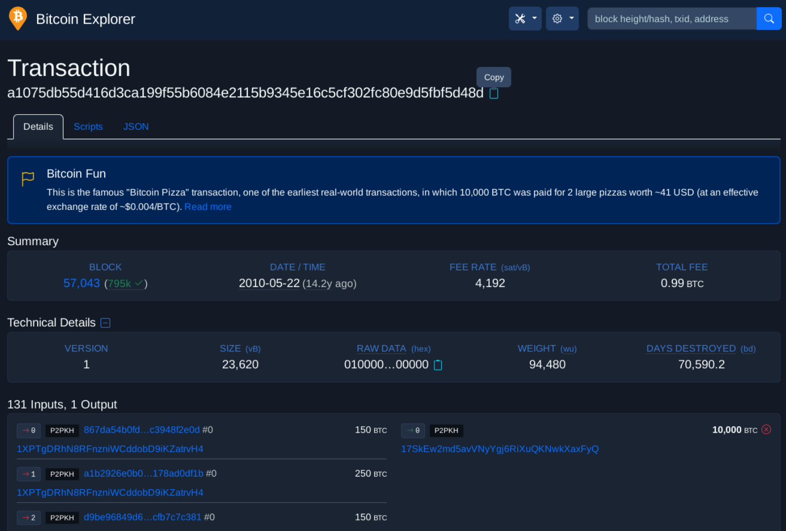
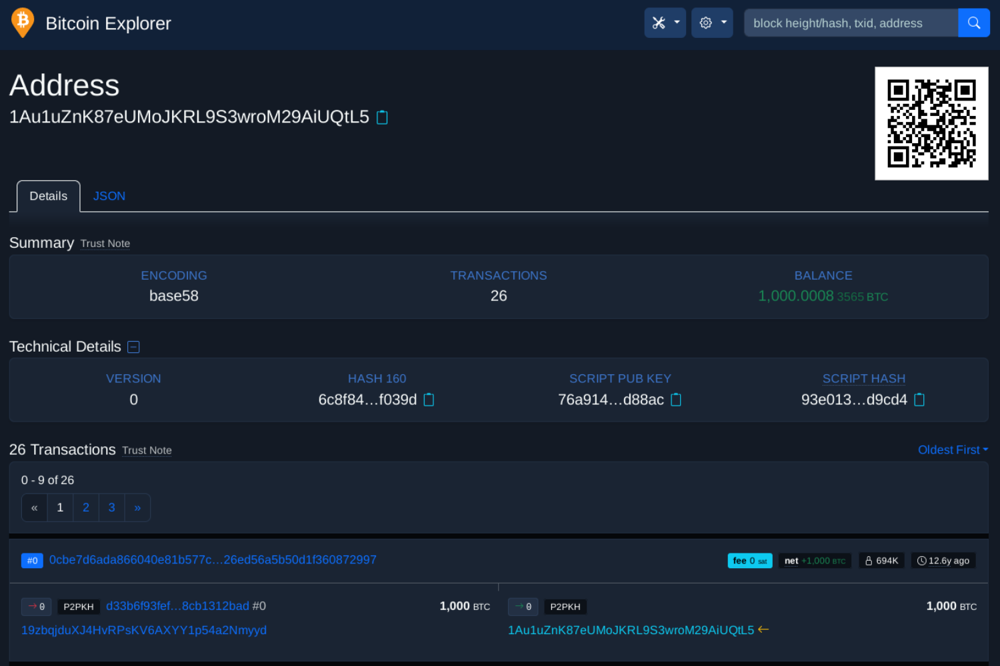
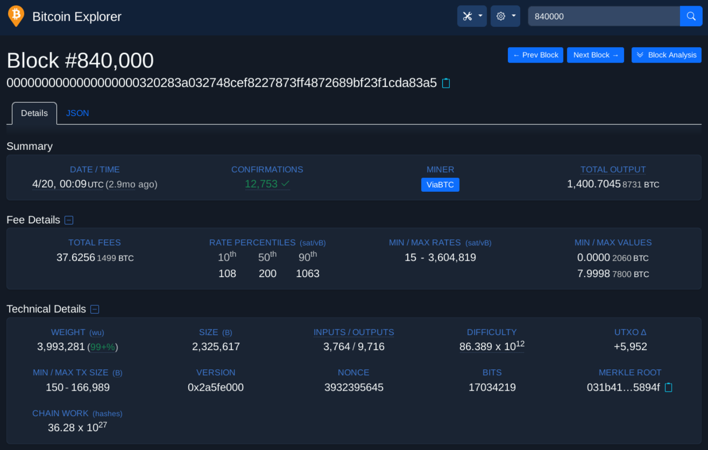
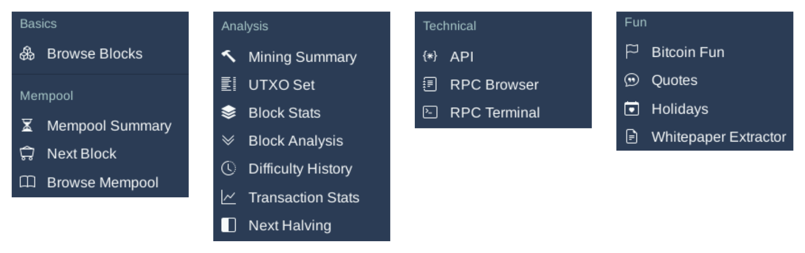

import { Steps } from '@astrojs/starlight/components';
import ImageZoom from 'starlight-image-zoom/components/ImageZoom.astro'

<ImageZoom />

When installing Dojo, by default a personal block explorer is also installed. This free and open source block explorer developed by Janoside is called "BTC-RPC Explorer".

If using a third-party block explorer (like many of the publicly available ones accessible on the internet), unless strict privacy practices are adhered to it is possible to leak your IP address to these services along with the transaction IDs / bitcoin addresses you have searched for. This can quickly allow these third-parties to build up a picture of what transactions you may be interested in, and cluster transactions and addresses to a single entity (you!) even if only accessing their service using the Tor browser!

Using your own personal self-hosted block explorer when looking up your own transactions and bitcoin addresses is therefore extremely important. Moreover, it allows you to explore transactions on the blockchain via the in-wallet browser or Tor Browser without needing to trust a third party to provide this information. While doing so may not be as quick and performant as a third-party block explorer, you can be safe in the knowledge that you are not leaking private information nor vulnerable to a man-in-the-middle attack.

## Obtain your personal block explorer .onion URL
In the terminal of your Dojo, copy and paste the following commands, then press `ENTER`.
<Steps>
1. Navigate to the Dojo script directory
    ```sh
    cd ~/dojo-app/docker/my-dojo
    ```
2. Enter the Dojo onion command
    ```sh
    ./dojo.sh onion
    ```

</Steps>
Shown in the terminal is your `Block Explorer` URL for your self-hosted personal block explorer.

### Save / bookmark the block explorer URL:
Copy and paste the `Block Explorer` .onion URL and paste it into your Tor browser. Then add this to your bookmarks.

You may also choose to add this URL:

- as a bookmark in your Tor mobile application on your Android device
- to your password manager

## Using BTC-RPC Explorer
### Landing page


### Look up transactions
Example:

- Bitcoin pizza day. Transaction ID:
`a1075db55d416d3ca199f55b6084e2115b9345e16c5cf302fc80e9d5fbf5d48d`


### Look up a bitcoin address
Example:

- Unspent 1,000 BTC Casascius coin. Address:
`1Au1uZnK87eUMoJKRL9S3wroM29AiUQtL5`


### Look up a bitcoin block
Example:

- Mining subsidy halving, 2024. Block:
`840000`


### Other tools and functionality
In addition to the above, BTC-RPC Explorer has many other tools and functionality to explore:


